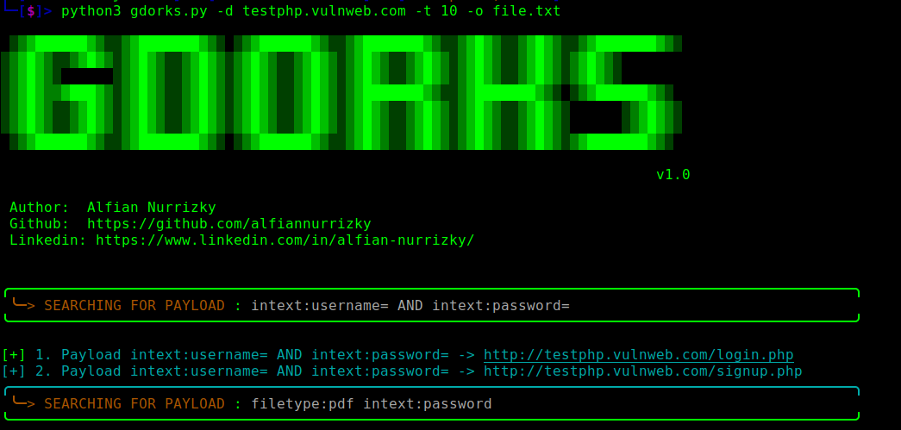

# <center>gdorks</center>

### <center>Automate Google Dorking</center> <br>



## Install

```
pip install googlesearch-python

▶ git clone https://github.com/alfiannurrizky/gdorks.git

cd gdorks

python3 gdorks.py -d domain.com -t 10
```

## Basic Usage

To contribute to G-DORKS, make sure you understand the basic usage of the following flags:

    -d <domain>: Specifies the domain name to be scanned. Make sure to provide the domain name correctly.
    -t <take>: Determines the number of results to be retrieved on each payload.
    -w <wordlist>: Path to the wordlist file (OPTIONAL).
    -o <output>: Save output to file (OPTIONAL).

Mandatory Command :

the -t flag is specific numbers you want.

```
python3 gdorks.py -d domain.com -t 10
```

If you have your own wordlist, gdorks can do it :

```
python3 gdorks.py -d domain.com -t 10 -w /path/to/your/file
```

Or if you want to save the output to file:

```
python3 gdorks.py -d domain.com -t 10 -w /path/to/your/file -o output.txt
python3 gdorks.py -d domain.com -t 10 -o output.txt
```

#### Contribution Guidelines

    1. Fork this repository.
    2. clone fork.
    3. create new branch e.g (feature/new-feature).
    4. push the new branch e.g (git push -u origin feature/new-feature ).
